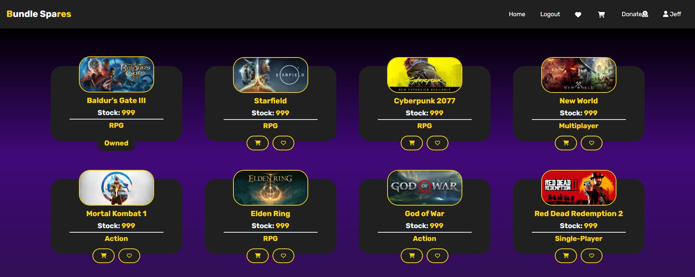

# Bundle-Spares

## Description

"Bundle Spares" is a specialized e-commerce platform designed for gamers and gaming enthusiasts. It provides a unique service by offering spare keys for video games that users can claim. Users can create accounts, explore a wide range of available game keys, add them to their carts, save games they're interested in for later, and view their claimed keys. The app features a robust authentication system to ensure user data security and privacy, offering gamers a convenient and secure way to access spare game keys for their favorite titles.

## Table of Contents

- [Live-Deployment](#live-deployment)
- [Installation](#installation)
- [Usage](#usage)
- [Contributing-Guidelines](#contributing-guidelines)
- [Future-Development-Goals](#future-development-goals)
- [Tests](#tests)
- [License](#license)
- [Questions](#questions)

## Live-Deployment

[bundlespares.com](bundlespares.com)

## Installation

1. Clone the repo into the desired location using the terminal command: `git clone https://github.com/jeffrpar/bundle-spares.git`

2. Open the local repository using VS Code. If you do not have VS Code installed, you can download it here: https://code.visualstudio.com/

3. Use the VS Code terminal and type `npm i` to install the dependencies required by the application.

4. Use the VS Code terminal and type `npm run build` to prepare the app to run.

5. You can then use the command `npm run develop` to run the application on a local server.

## Usage

Users can create accounts, add items to their shopping carts, save items for later, and view their order history.

## Contributing-Guidelines

We welcome and appreciate contributions from the community! Whether you want to fix a bug, add new features, or improve documentation, your contributions are valuable in making this project better.

To ensure a smooth and collaborative development process, please follow the guidelines below when making contributions:

**Getting Started**

1. Fork the repository on GitHub.

2. Clone your forked repository to your local machine.

**Making Changes**

3. Create a new branch from the main branch to work on your changes.

4. Make your changes, following the code style and guidelines.

5. Commit your changes with a descriptive commit message.

**Code Style and Guidelines**

Please follow our coding conventions and style guidelines when writing code. If unsure, refer to existing code for examples.
Testing

Ensure that your changes pass all existing tests. If you're adding new features, include appropriate test cases.

**Submitting a Pull Request**

6. Push your changes to your forked repository.
7. Submit a pull request (PR) to the main branch of this repository.
8. Provide a detailed description of your changes in the PR. **Ensure your PR's title and description are clear and descriptive.

**Code Review**

Your pull request will be reviewed by the maintainers, who may provide feedback or request changes before merging.

## Future-Development-Goals

- Add a section where users can upload spare keys for games they want to share with the community

- Advanced Search and Filters: Improve the search functionality with advanced filters like genre, release date, or platform, making it easier for users to find specific games.

- Mobile App: Develop a mobile application for "Bundle Spares" to reach a broader audience and provide on-the-go access to game keys.

## Tests

There are currently no tests written for this application.

## License

Please refer to the GNU General Public License v3.0 information [here](https://www.gnu.org/licenses/gpl-3.0.en.html#license-text).

## Questions

Github profile: [https://github.com/jeffrpar](https://github.com/jeffrpar) & [https://github.com/OkamiXX](https://github.com/OkamiXX).

If you have any additional questions about this application, please reach out to me via email at [jeffrpar@gmail.com](jeffrpar@gmail.com).